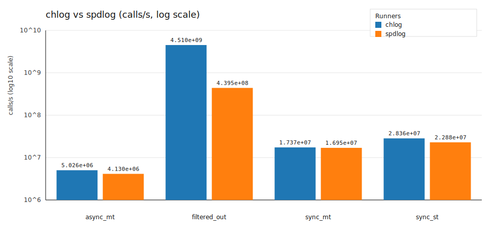

# chlog

`chlog` is a lightweight and efficient modern **header-only** C++ logging library designed to be simple, optionally async, and sink-extensible.

- Language standard: C++20 (uses `std::format` / `std::source_location`)
- Platforms: Windows / Linux / macOS (time formatting uses `localtime_s` on Windows)

## Features

- **Sync / async**: toggle via `logger_config::async.enabled`.
- **Fast async wakeups**: async queue uses a bounded MPSC ring buffer with `std::counting_semaphore`-based wakeups (reduces sleep/wakeup overhead).
- **Single-threaded ultra-fast mode**: `logger_config::single_threaded` (not thread-safe; disables async + parallel_sinks).
- **Bounded queue + priority dropping**: when full, prefers dropping `trace/debug/info`, while trying to keep `warn+`.
- **Optional fmt backend**: define `CHLOG_USE_FMT=1` to format via `{fmt}` for higher throughput; default stays `std::format`.
- **Multiple sinks**: `console_sink`, `rotating_file_sink`, `daily_file_sink`, `json_sink`.
- **Optional parallel sinks**: `logger_config::parallel_sinks` + built-in thread pool (sync mode only).
- **Call-site info**: built-in `std::source_location`; pattern/JSON can output `{file}` `{line}` `{func}`.
- **Robustness**: formatting failures / sink exceptions are swallowed to avoid crashing the main flow.


### Latest results



| Case | chlog | spdlog |
|---|---:|---:|
| async_mt | 5.026e+06 | 4.130e+06 |
| filtered_out | 4.510e+09 | 4.395e+08 |
| sync_mt | 1.737e+07 | 1.695e+07 |
| sync_st | 2.836e+07 | 2.288e+07 |

Full details (including per-case tables, CPU/memory, and library versions) are in [docs/logbench_results.md](docs/logbench_results.md).

## Quick Start

```cpp
#include <chlog/chlog.hpp>

int main() {
    using namespace chlog;

    logger_config cfg;
    cfg.name = "app";
    cfg.level = level::debug;
    cfg.pattern = "[{date} {time}.{ms}][{lvl}][{name}][{file}:{line}] {msg}";

    cfg.async.enabled = true;
    cfg.async.queue_capacity = 1u << 16;
    cfg.async.batch_max = 256;
    cfg.async.flush_every = std::chrono::milliseconds(200);

    auto lg = std::make_shared<logger>(cfg);
    lg->add_sink(std::make_shared<console_sink>(console_sink::style::plain));
    lg->add_sink(std::make_shared<rotating_file_sink>("logs/app.log", 32 * 1024 * 1024, 5));

    lg->info("hello {}", 123);
    lg->warn("disk {}%", 95);

    lg->shutdown();
}
```

## Single-threaded mode (`logger_config::single_threaded`)

If your application logs from exactly one thread (typical in some game loops, embedded, or single-threaded tools), you can enable:

- `cfg.single_threaded = true;`

Behavior:

- No thread-safety guarantees: calling the same logger/sinks from multiple threads is undefined.
- For maximum throughput, chlog forces `async.enabled = false` and `parallel_sinks = false` in this mode (no internal worker threads; no cross-thread sink writes).
- Built-in sinks also skip their internal mutexes when single-threaded.

## Parallel sinks (`logger_config::parallel_sinks`)

`parallel_sinks` controls whether **sync-mode** logging fans out a single log event to multiple sinks in parallel.

- When `cfg.async.enabled == false` and `cfg.parallel_sinks == true`, `logger::add_sink()` lazily creates an internal thread pool and each log event will enqueue one task per sink.
- When `cfg.async.enabled == true`, chlog intentionally keeps sink writes on the **single async worker thread** for best throughput and lower overhead; `parallel_sinks` does not change async behavior.

`logger_config::sink_pool_size` controls the number of worker threads used for parallel sinks:

- `0` (default): uses `sinks.size()` at the time the pool is created.
- `> 0`: uses that fixed size.

Trade-offs (important):

- **Ordering**: with `parallel_sinks` enabled, strict ordering across sinks (and even within the same sink under contention) is not guaranteed.
- **Flush semantics**: in sync mode with `parallel_sinks`, `flush_on_level` and `logger::flush()` are best-effort because sink writes are happening on background pool threads.

Recommendation:

- Use `parallel_sinks = true` if you have multiple slow sinks (e.g. file + network) and you prefer higher throughput over strict ordering/flush guarantees.
- Use `parallel_sinks = false` if you require strict ordering and synchronous flush behavior.

### Pattern

Default pattern:

- `[{date} {time}.{ms}][{lvl}][tid={tid}][{name}] {msg}`

Available tokens:

- `{ts}` `{date}` `{time}` `{ms}` `{lvl}` `{tid}` `{name}` `{msg}` `{file}` `{line}` `{func}`

Special pattern:

- `{json}`: outputs a single-line JSON record (includes file/line/func).

### Macros (Optional)

If you want to force capturing call-site info without changing your function signatures, you can use:

- `CHLOG_INFO(*lg, "msg {}", x)`
- `CHLOG_ERROR(*lg, "oops {}", err)`
- etc.

## Build with CMake

```powershell
cmake -S . -B build
cmake --build build --config Release
```

Example (enabled by default):

- `chlog_stress` (built from `examples/chlog_stress.cpp`)
- `chlog_single_thread_bench` (built from `examples/single_thread_bench.cpp`)

## Benchmarks (chlog vs spdlog)

This repo includes a simple benchmark executable that compares **chlog** vs **spdlog** in a tight loop,
using an in-memory counting sink (no I/O) to focus on call-site + formatting + dispatch overhead.

Note: for a fairer comparison, the benchmark enables `CHLOG_USE_FMT=1` for chlog when spdlog is available,
so both libraries use the same formatting backend.

Benchmark executable:

- `chlog_bench_loggers`

### Dependencies (via vcpkg)

Install spdlog:

```powershell
vcpkg install spdlog
```

### Configure with vcpkg + clang

Example using Ninja + clang-cl on Windows:

```powershell
$env:VCPKG_ROOT = "C:\\path\\to\\vcpkg"
cmake -S . -B build-ninja-clang -G Ninja `
    -DCMAKE_BUILD_TYPE=Release `
    -DCMAKE_TOOLCHAIN_FILE="$env:VCPKG_ROOT\\scripts\\buildsystems\\vcpkg.cmake" `
    -DCMAKE_CXX_COMPILER=clang-cl

cmake --build build-ninja-clang
```

### Run

Iterations can be set via `--iters` or `CHLOG_BENCH_ITERS`:

```powershell
$env:CHLOG_BENCH_ITERS = "1000000"
./build-ninja-clang/chlog_bench_loggers

./build-ninja-clang/chlog_bench_loggers --iters 2000000
```

The program prints machine-parsable lines:

- `RESULT runner=... case=... calls=... seconds=... cps=... processed=... dropped=...`

### Generate Markdown report

```powershell
python ./tools/logbench_report.py --build-dir build-ninja-clang --out docs/logbench_results.md --iters 1000000
```

The report includes:

- CPU + total memory info
- vcpkg versions for `spdlog` (and `fmt` if present)

Note:

- there may defferent results between platforms

### Regenerate report + chart

```powershell
python ./tools/logbench_report.py --build-dir build-ninja-clang --out docs/logbench_results.md --iters 2000000
python ./tools/logbench_plot.py --in docs/logbench_results.md --out docs/logbench_summary.svg
```
  