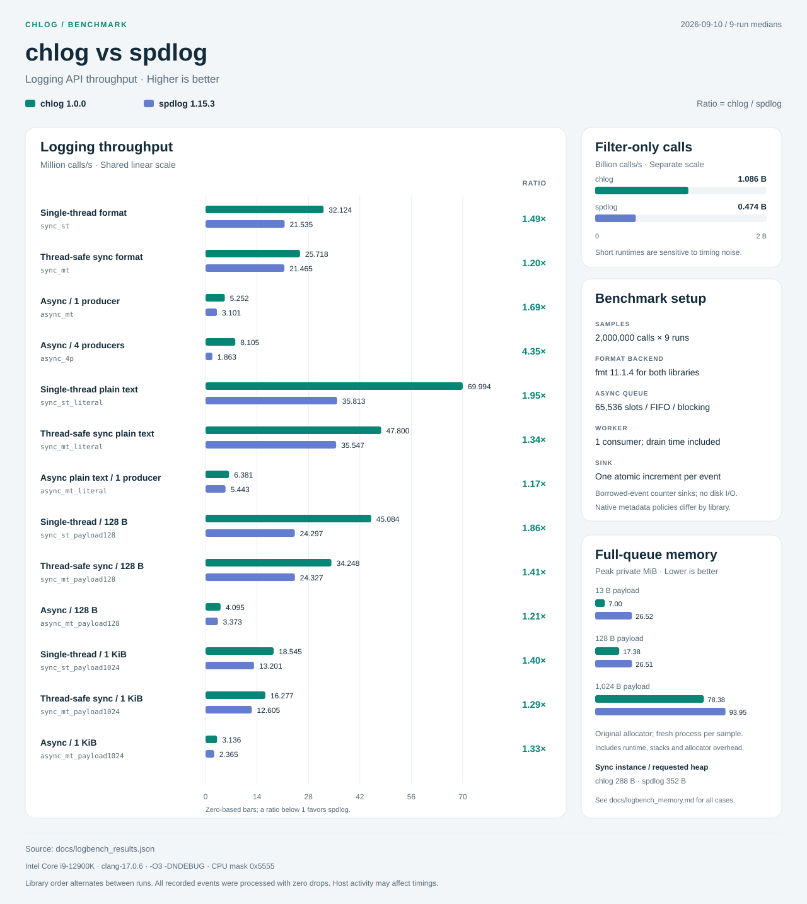

# chlog

`chlog` is a lightweight, modern, **header-only** C++20 logging library: simple at the call site, configurable for throughput (optional async), and extensible via sinks.

- **C++20**: uses `std::format` and `std::source_location`
- **Platforms**: Windows / Linux / macOS (`localtime_s` on Windows, `localtime_r` elsewhere)

> 中文一句话：`chlog` 主打“高性能、调用端轻、吞吐高、可选异步、可插拔 sink、 线程安全可选”，并且尽量把开销留在需要的时候。

## Highlights

- **Sync / async**: toggle via `logger_config::async.enabled`
- **Fast async wakeups**: bounded MPSC ring buffer + `std::counting_semaphore`
- **Single-threaded ultra-fast mode**: `logger_config::single_threaded` (not thread-safe; forces async + parallel_sinks off)
- **Bounded queue + priority dropping**: prefers dropping `trace/debug/info` while keeping `warn+`
- **Optional {fmt} backend**: define `CHLOG_USE_FMT` to use `{fmt}` for formatting (default: `std::format`)
- **Built-in sinks**: `console_sink`, `rotating_file_sink`, `daily_file_sink`, `json_sink`
- **Optional parallel sinks**: `logger_config::parallel_sinks` (sync mode only)
- **Call-site info**: `std::source_location` → `{file}` `{line}` `{func}` (pattern / JSON)
- **Robustness**: formatting failures / sink exceptions are swallowed (logging should not crash your app)
- **Compiled patterns**: parse once; render only requested fields, with cached calendar and thread-id text
- **Bounded parallel work**: `sink_queue_capacity` limits pending sink tasks and applies backpressure
- **Reliable lifecycle**: `flush()` waits for previous queued writes; shutdown drains accepted work and is idempotent
- **Diagnostics**: `stats().errors`, `should_log()`, `queue_capacity()`, and `log_raw()` for preformatted text

## Contents

- [chlog](#chlog)
  - [Highlights](#highlights)
  - [Contents](#contents)
  - [Optimization and validation](#optimization-and-validation)
  - [Historical results](#historical-results)
  - [Quick Start](#quick-start)
  - [Feature spotlight: message-only mode](#feature-spotlight-message-only-mode)
    - [Example: high-throughput message-only async file logger](#example-high-throughput-message-only-async-file-logger)
  - [Single-threaded mode (`logger_config::single_threaded`)](#single-threaded-mode-logger_configsingle_threaded)
  - [Parallel sinks (`logger_config::parallel_sinks`)](#parallel-sinks-logger_configparallel_sinks)
  - [Queue, lifecycle, and metrics](#queue-lifecycle-and-metrics)
    - [Pattern](#pattern)
    - [Macros (Optional)](#macros-optional)
  - [Build with CMake](#build-with-cmake)
  - [Install via vcpkg](#install-via-vcpkg)
  - [Benchmarks (chlog vs spdlog)](#benchmarks-chlog-vs-spdlog)
    - [Dependencies (via vcpkg)](#dependencies-via-vcpkg)
    - [Configure with vcpkg + clang](#configure-with-vcpkg--clang)
    - [Run](#run)
    - [Generate Markdown report](#generate-markdown-report)
    - [Regenerate report + chart](#regenerate-report--chart)

## Optimization and validation

The current implementation and before/after measurements are documented in
[the second optimization report](docs/optimization_round2.md), with the earlier correctness
and rendering changes in [the first report](docs/optimization_results.md). The chart below is a historical
comparison with spdlog; it is not a measurement of the current revision.

## Historical results



| Case | chlog | spdlog |
|---|---:|---:|
| async_mt | 5.026e+06 | 4.130e+06 |
| filtered_out | 4.510e+09 | 4.395e+08 |
| sync_mt | 1.737e+07 | 1.695e+07 |
| sync_st | 2.836e+07 | 2.288e+07 |

Full details (including per-case tables, CPU/memory, and library versions) are in [docs/logbench_results.md](docs/logbench_results.md).

## Quick Start

```cpp
#include <chlog/chlog.hpp>

int main() {
    using namespace chlog;

    logger_config cfg;
    cfg.name = "app";
    cfg.level = level::debug;
    cfg.pattern = "[{date} {time}.{ms}][{lvl}][{name}][{file}:{line}] {msg}";

    cfg.async.enabled = true;
    cfg.async.queue_capacity = 1u << 16;
    cfg.async.batch_max = 256;
    cfg.async.flush_every = std::chrono::milliseconds(200);

    auto lg = std::make_shared<logger>(cfg);
    lg->add_sink(std::make_shared<console_sink>(console_sink::style::plain));
    lg->add_sink(std::make_shared<rotating_file_sink>("logs/app.log", 32 * 1024 * 1024, 5));

    lg->info("hello {}", 123);
    lg->warn("disk {}%", 95);

    lg->shutdown();
}
```

## Feature spotlight: message-only mode

If you only need the formatted message (no timestamp / thread id / logger name / source location), set:

- `cfg.pattern = "{msg}";`

In this mode, `chlog` skips metadata that sinks do not require. `daily_file_sink` requests
timestamps and `json_sink` requests all metadata, so adding either sink still works with
`{msg}`. Explicit `capture_* = false` settings remain respected. Custom sinks can override
`required_metadata()` using `sink::timestamp`, `thread_id`, `logger_name`, and `source_location`.
Changing the pattern restores the configured capture behavior for subsequent calls.

### Example: high-throughput message-only async file logger

```cpp
#include <chlog/chlog.hpp>

#include <chrono>
#include <memory>

int main() {
    using namespace chlog;

    logger_config cfg;
    cfg.name = "fast";
    cfg.level = level::info;

    // Feature: message-only mode disables metadata capture automatically.
    cfg.pattern = "{msg}";

    cfg.async.enabled = true;
    cfg.async.queue_capacity = 1u << 16;
    cfg.async.batch_max = 512;
    cfg.async.flush_every = std::chrono::milliseconds(200);

    auto lg = std::make_shared<logger>(cfg);
    lg->add_sink(std::make_shared<rotating_file_sink>("logs/fast.log", 8 * 1024 * 1024, 3));

    for (int i = 0; i < 100000; ++i) {
        lg->info("tick {}", i);
    }

    lg->shutdown();
}
```

Notes:

- If you need any metadata, use a pattern token (e.g. `[{lvl}] {msg}` or `[{date} {time}.{ms}] {msg}`) and keep the corresponding `capture_*` flags enabled.
- If you want structured output, prefer `{json}` (see “Pattern”).

## Single-threaded mode (`logger_config::single_threaded`)

If your application logs from exactly one thread (typical in some game loops, embedded, or single-threaded tools), you can enable:

- `cfg.single_threaded = true;`

Behavior:

- No thread-safety guarantees: calling the same logger/sinks from multiple threads is undefined.
- For maximum throughput, chlog forces `async.enabled = false` and `parallel_sinks = false` in this mode (no internal worker threads; no cross-thread sink writes).
- Built-in sinks also skip their internal mutexes when single-threaded.

## Parallel sinks (`logger_config::parallel_sinks`)

`parallel_sinks` controls whether **sync-mode** logging fans out a single log event to multiple sinks in parallel.

- When `cfg.async.enabled == false` and `cfg.parallel_sinks == true`, `logger::add_sink()` lazily creates an internal thread pool and each log event will enqueue one task per sink.
- When `cfg.async.enabled == true`, chlog intentionally keeps sink writes on the **single async worker thread** for best throughput and lower overhead; `parallel_sinks` does not change async behavior.

`logger_config::sink_pool_size` controls the number of worker threads used for parallel sinks:

- `0` (default): uses `sinks.size()` at the time the pool is created.
- `> 0`: uses that fixed size.

Trade-offs (important):

- **Ordering**: with `parallel_sinks` enabled, strict ordering across sinks (and even within the same sink under contention) is not guaranteed.
- **Backpressure**: at most `sink_queue_capacity` tasks wait in the pool (default 1024), plus active worker tasks. Producers block when full. Event strings are shared across the tasks for that event.
- **Flush semantics**: `logger::flush()` waits for pending tasks before flushing sinks. A `flush_on_level` record is flushed by each sink's task after that record is written.

Recommendation:

- Use `parallel_sinks = true` if you have multiple slow sinks (e.g. file + network) and you prefer higher throughput over strict ordering/flush guarantees.
- Use `parallel_sinks = false` for immediate synchronous writes and lower scheduling overhead.

## Queue, lifecycle, and metrics

- `async.queue_capacity` is the actual number of event slots, with a minimum of 4 in
  weighted mode or 2 in FIFO mode. Capacities are no longer rounded up independently
  for each priority tier. `queue_capacity()` reports the effective value.
- `weighted_queue = true` reserves approximately one quarter of the slots for `warn+`
  (at least two). Both tiers receive service; ordering is preserved within each tier.
  Set `weighted_queue = false` for a single FIFO queue.
- With `drop_when_full = true`, low-priority events can be dropped; `warn+` blocks.
  With it disabled, all producers block on overload. Shutdown cancels blocked
  submissions and counts them as dropped; every accepted record is drained.
- `batch_max = 0` is normalized to 1; oversized batches are clamped to queue capacity.
  `flush_every <= 0` disables periodic flushing, while explicit and level-triggered
  flushes remain available. Positive intervals also work while the queue is idle;
  intervals beyond the steady clock's range saturate to its maximum deadline.
- Async `flush()` waits for records reserved before its queue snapshot to finish
  writing, including both priority tiers. Writes started concurrently may be included.
  Stream flushing does not promise durable disk synchronization (`fsync`).
- `shutdown()` waits for in-flight submissions, drains accepted work, and flushes once.
  Concurrent shutdown callers wait for the same completion. Later log calls are ignored.
  The object must remain alive until all threads using it have finished.
- `stats().enqueued` and `dequeued` count accepted and completed events in every mode.
  Async acceptance is counted when a producer reserves a queue slot, before publication.
  `queue_size` excludes records/tasks already executing and is approximate during
  concurrent activity. A live stats snapshot is not atomic across counters; counters
  form an exact final balance after shutdown.
  `errors` counts formatting and sink failures; a formatting failure logs the original
  format string. Allocation failure is not guaranteed to be recoverable.

Built-in sink level changes and pattern rendering are safe alongside logging.
`set_pattern()` publishes an immutable compiled pattern per sink; queued records use
the pattern current when rendered. Call `flush()` first when a clean pattern boundary
is needed. Configure `set_thread_safe()` before sharing a sink with logging threads.
Custom sinks reading the protected `pattern_` directly must synchronize those reads;
using `render()` handles the synchronization. Sink callbacks must not re-enter their
own logger's logging, flush, or shutdown methods.

In thread-safe mode, `add_sink()` can append new sinks while logging. Each synchronous
dispatch (or asynchronous batch) captures the list's current end; later additions do
not extend that dispatch. The logger retains its sink references until destruction.
No-argument messages without braces bypass the formatting backend; escaped braces
and runtime format errors keep their usual formatting behavior.

File sinks open in binary mode for exact byte accounting and throw on open failures.
Rotating files keep whole records, rotate before overflow, and retain up to `max_files`
backups. A record larger than `max_bytes` occupies a file by itself; `max_bytes = 0`
is rejected. Write/rotation failures are counted in logger errors. On platforms whose
C runtime cannot represent a timestamp in local time (including pre-1970 Windows
timestamps), calendar formatting falls back to UTC; years outside 0000–9999 render
an unavailable-date placeholder.

For already formatted text or literal braces:

```cpp
lg->log_raw(chlog::level::info, "literal {braces}");
if (lg->should_log(chlog::level::debug)) {
    lg->debug("expensive value: {}", calculate_value());
}
```

### Pattern

Default pattern:

- `[{date} {time}.{ms}][{lvl}][tid={tid}][{name}] {msg}`

Available tokens:

- `{ts}` `{date}` `{time}` `{ms}` `{lvl}` `{tid}` `{name}` `{msg}` `{file}` `{line}` `{func}`

Special pattern:

- `{json}`: outputs a single-line JSON record (includes file/line/func).

### Macros (Optional)

If you want to force capturing call-site info without changing your function signatures, you can use:

- `CHLOG_INFO(*lg, "msg {}", x)`
- `CHLOG_ERROR(*lg, "oops {}", err)`
- etc.

Macros capture the application call site when source capture is enabled. The ordinary
`info()`/`log()` helpers capture a location inside the helper; use a macro, explicit
`log_at()`, or `log_raw()` for the application file and line.

## Build with CMake

```powershell
cmake -S . -B build
cmake --build build --config Release
ctest --test-dir build -C Release --output-on-failure
```

Tests cover formatting, queues, concurrency, flushing, rotation, error recovery,
configuration, and an independent consumer of the installed CMake package. Disable
them with `-DCHLOG_BUILD_TESTS=OFF`. To use fmt for every target and exported consumer:

```powershell
cmake -S . -B build-fmt -DCHLOG_USE_FMT=ON -DCMAKE_PREFIX_PATH="path/to/fmt/install"
cmake --build build-fmt --config Release
ctest --test-dir build-fmt -C Release --output-on-failure
```

The fmt backend uses `fmt::format_string` and `fmt::formatter` without including
`<format>`. Manual header users must define `CHLOG_USE_FMT` consistently across
translation units and link fmt; CMake manages this automatically with the option above.

## Install via vcpkg

Once the `chlog` port is available in your vcpkg registry (or you use this repo's overlay port under `ports/chlog`), install with:

```powershell
vcpkg install chlog
```

Consume from CMake:

```cmake
find_package(chlog CONFIG REQUIRED)
target_link_libraries(your_target PRIVATE chlog::chlog)
```

Example (enabled by default):

- `chlog_stress` (built from `examples/chlog_stress.cpp`)
- `chlog_single_thread_bench` (built from `examples/single_thread_bench.cpp`)

## Benchmarks (chlog vs spdlog)

This repo includes a simple benchmark executable that compares **chlog** vs **spdlog** in a tight loop,
using an in-memory counting sink (no I/O) to focus on call-site + formatting + dispatch overhead.

Note: for a fairer comparison, the benchmark enables `CHLOG_USE_FMT` for chlog when spdlog is available,
so both libraries use the same formatting backend.

Benchmark executable:

- `chlog_bench_loggers`
- `chlog_render_bench` (render time, allocations, queue construction, logger-name allocations, sink registration)

Async benchmarks use a fixed 65,536-slot queue and blocking overflow instead of
allocating a queue proportional to the iteration count. `async_4p` uses four producer
threads; `async_mt` uses one producer with a thread-safe logger. The executable exits
with an error if the expected processed count is not reached. Cases ending in `_literal`
measure plain messages without arguments. Renderer allocation
measurements count requested heap bytes, not process RSS.

### Dependencies (via vcpkg)

Install spdlog:

```powershell
vcpkg install spdlog
```

### Configure with vcpkg + clang

Example using Ninja + clang on Windows:

```powershell
$env:VCPKG_ROOT = "C:\\path\\to\\vcpkg"
cmake -S . -B build-ninja-clang -G Ninja `
    -DCMAKE_BUILD_TYPE=Release `
    -DCMAKE_TOOLCHAIN_FILE="$env:VCPKG_ROOT\\scripts\\buildsystems\\vcpkg.cmake" `
    -DCMAKE_CXX_COMPILER=clang

cmake --build build-ninja-clang
```

### Run

Iterations can be set via `--iters` or `CHLOG_BENCH_ITERS`:

```powershell
$env:CHLOG_BENCH_ITERS = "1000000"
./build-ninja-clang/chlog_bench_loggers

./build-ninja-clang/chlog_bench_loggers --iters 2000000
```

The program prints machine-parsable lines:

- `RESULT runner=... case=... calls=... seconds=... cps=... processed=... dropped=...`

### Generate Markdown report

```powershell
python ./tools/logbench_report.py --build-dir build-ninja-clang --out docs/logbench_results.md --iters 1000000
```

The report includes:

- CPU + total memory info
- vcpkg versions for `spdlog` (and `fmt` if present)

Note:

- results may differ between platforms

### Regenerate report + chart

```powershell
python ./tools/logbench_report.py --build-dir build-ninja-clang --out docs/logbench_results.md --iters 2000000
python ./tools/logbench_plot.py --in docs/logbench_results.md --out docs/logbench_summary.svg
```
